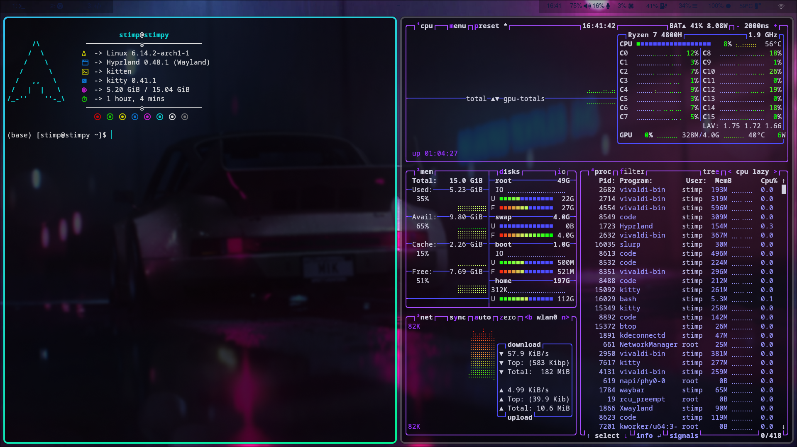

# Dot Files for Hyprland Arch Experience

This repository contains **dotfiles** for configuring the **Hyprland Window Manager** on an **Arch Linux** system.

## Preview 


## 📦 Packages

This repository contains dot files for the following software:

- **Hyprland** – Wayland compositor
- **Waybar** – status bar
- **Kitty** – terminal 
- **Neovim** – text editor
- **Rofi** – application launcher
- **Shell (`bashrc')** – shell config

## 📂 Installation

Easily replicate this setup on any system using **GNU Stow**.

### **1️⃣ Clone the Repository**

```bash
git clone https://github.com/Srindot/MeeDot-.-Files.git
cd hyprland-dotfiles
```

2️⃣ Install GNU Stow

Make sure GNU Stow is installed:

```bash
sudo pacman -S stow  # Arch-based systems
```

3️⃣ Deploy Dotfiles with Stow
Run the following command to symlink the configurations:

```bash
stow hyprland waybar rofi nvim kitty
```

This will correctly symlink the dotfiles into your ~/.config directory.

## Auto Setup

### 📌 Prerequisites

Make sure you have:

- **Arch Linux** installed
- **Hyprland** set up
- **GNU Stow** installed (`pacman -S stow`)

### 🔧 Installation

Clone the repository and run the setup script:

```bash
git clone https://github.com/Srindot/MeeDot-.-Files.git
cd YOUR_REPO
chmod +x setup.sh
./setup.sh
```

